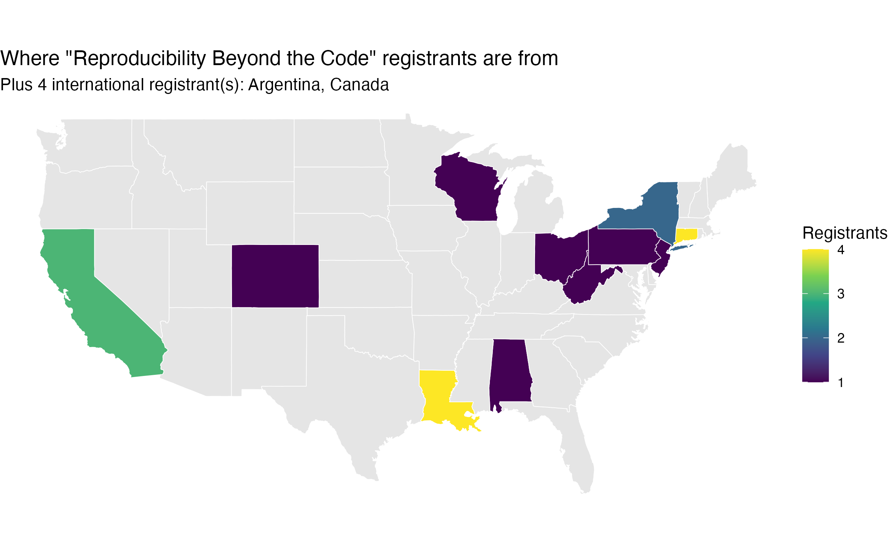
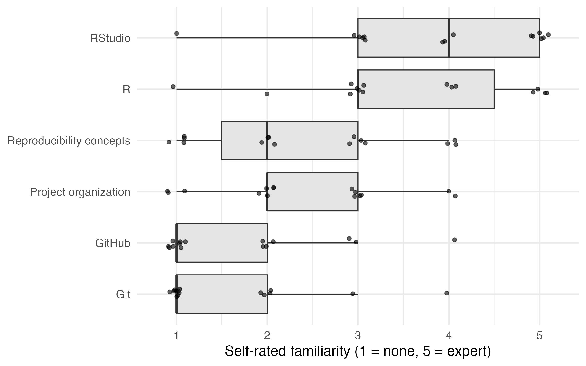
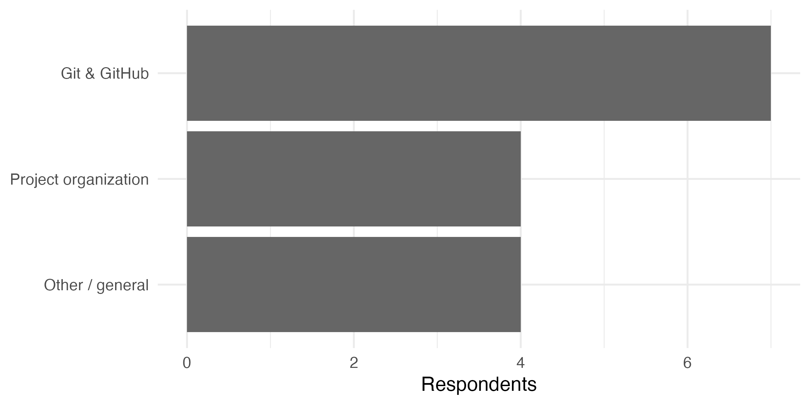
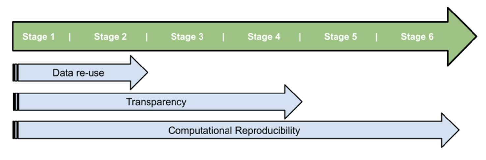

## Welcome

- 4-hour hands-on workshop
- Bring an active research project if you have one
- No experience using R or GitHub is necessary, but basic familiarity with research, data management, and data analysis is assumed

## Why this workshop?

- Reproducibility is now a baseline expectation
- Most struggles aren't about complex analyses
- They're about structure, documentation, and organization

## Today's roadmap

1. Organizing R projects & repositories
2. Documentation (READMEs, data dictionaries)
3. Git & GitHub for version control and archiving

# Who's in the room?

## Where are you joining from?

{fig-align="center" width="80%"}

## What are we starting from?

{fig-align="center" width="80%"}

Pre-workshop survey, n = 15 respondents

## What do you want to get out of this?

{fig-align="center" width="80%"}

## SORTEE guidelines for computational reproducibility

SORTEE: Society for Open, Reliable, and Transparent Ecology and Evolutionary Biology

Pick, J. L., B. J. Allen, B. Bachelot, K. R. Bairos-Novak, J. A. Brand, B. Class, T. Dallas, P. B. D’Amelio, E. Fenollosa, E. Fernández-Juricic, D. G. E. Gomes, et al. (2026). The SORTEE guidelines for data and code quality control in ecology and evolutionary biology. Peer Community Journal 6:e20.

## SORTEE guidelines
- Stage 1: Data must be archived and adhere to FAIR guiding principles.
- Stage 2: Archived data corresponds with the data reported in the manuscript.
- Stage 3: Code must be archived and adhere to FAIR guiding principles.
- Stage 4: Archived code corresponds with the workflow reported in the manuscript.
- Stage 5: Archived code runs with the archived data.
- Stage 6: Results can be computationally reproduced by running the archived code

## SORTEE's three goals

{fig-align="center" width="90%"}

Data re-use, transparency, and computational reproducibility — each spanning a different subset of the six stages

# Part 1: Organizing R projects

## A logical directory structure

```
project/
├── Data/       # raw, unmodified source data
├── Derived/    # outputs generated by scripts
├── Figures/    # saved plots
├── Scripts/    # code
└── README.md
```

## Structuring a script

- Clear header: purpose, inputs, outputs
- Section labels for navigation
- One or a few related goals per script
- Should run start to finish (or until `stop()`)
- Output of one script is often input of next script

## Typical workflow

Scripts/
- 00_wrangling.R
- 01_exploratory.R
- 02a_analysis.R
- 02b_analysis.R
- 03_plotting.R
- 04_manuscript.qmd

## Sandbox

A place for exploring ideas without cluttering your primary analysis scripts

# Part 2: Documentation

## Writing an effective README

- What is this project?
- What's in each folder?
- What order do I run things in?
- License

## Data dictionaries

- One row per variable
- Name, type, units, description
- Lightweight — a table is enough

# Part 3: Git & GitHub

## Why version control?

- Track changes over time
- Recover earlier versions safely
- Refactor and delete with confidence

## GitHub vocabulary

- **Version control** — tracking changes to files over time, with the ability to go back
- **Fork** — your own copy of someone else's repository, on GitHub
- **Clone** — download a copy of a repository to your computer
- **Branch** — a parallel line of work, isolated from the main version until merged
- **Commit** — save a snapshot of your changes, with a message
- **Push** — upload your local commits to GitHub
- **Pull** — download the latest commits from GitHub to your computer
- **Pull request** — ask the original repo's owner to merge your branch in

## Collaborating on GitHub: the workflow

1. **Fork** the repository, on GitHub
2. **Clone** your fork, to your computer
3. **Branch** — create a new branch for your change
4. Edit your files
5. **Commit** your changes
6. **Push** your branch to GitHub
7. Open a **pull request** back to the original repo

## `.gitignore`

- Decide what *shouldn't* be tracked
- Large/raw data, generated outputs, secrets

## GitHub & journals

- Meeting data/code availability requirements
- Public archiving of research outputs

## Hands-on time

- Create a GitHub account, if you don't already have one
- Create your first repository
- Link it with R/RStudio (or your preferred IDE)
- Apply this to your own project
- Ask questions as you go
